# Tutorial 01 — Preparando o ambiente TypeScript

## Objetivos

Ao final deste tutorial, você deverá ser capaz de:

- instalar e verificar o Node.js;
- verificar o npm;
- utilizar o Visual Studio Code;
- criar um projeto TypeScript;
- instalar o TypeScript;
- compreender o papel do `package.json`;
- compreender o papel do `tsconfig.json`;
- criar um arquivo `.ts`;
- compilar um arquivo TypeScript;
- executar o JavaScript gerado.

Neste primeiro tutorial, nosso objetivo é preparar o ambiente de desenvolvimento.

Ainda não vamos estudar arrays, classes, objetos, Repository ou banco de dados.

---

## Pré-requisitos

Você precisará de:

- um computador;
- acesso à internet;
- Node.js;
- npm;
- Visual Studio Code.
- Extensão Mermaid instalada.
- Extensão Markdown Preview Enhanced instalada

Não é necessário ter conhecimento prévio de TypeScript.

---

## 1. Conhecendo as ferramentas

Antes de criar nosso primeiro projeto, precisamos entender quais ferramentas serão utilizadas.

### Node.js

O Node.js permite executar JavaScript fora de um navegador.

Durante nossos estudos, utilizaremos o Node.js para executar os programas JavaScript produzidos a partir do nosso código TypeScript.

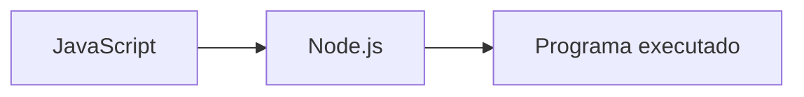

### npm

O npm é o gerenciador de pacotes utilizado com o Node.js.

Ele será utilizado para:

- criar a configuração do projeto;
- instalar o TypeScript;
- posteriormente instalar outras dependências.

Por exemplo:

```bash
npm install --save-dev typescript
```

### TypeScript

O TypeScript é a linguagem que utilizaremos durante esta série.

Os arquivos TypeScript normalmente possuem a extensão:

```text
.ts
```

O código TypeScript será compilado para JavaScript.

O processo básico será:

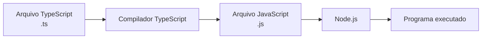

Essa sequência será importante durante toda a série.

### Visual Studio Code

O Visual Studio Code, ou simplesmente VS Code, será nosso editor de código.

Será nele que criaremos:

- arquivos TypeScript;
- projetos;
- exercícios;
- exemplos;
- aplicações.

---

## 2. Verificando o Node.js

Abra o terminal.

No Windows, você pode utilizar, por exemplo:

- PowerShell;
- Prompt de Comando;
- terminal integrado do VS Code.

Execute:

```bash
node --version
```

Se o Node.js estiver instalado corretamente, você deverá receber uma resposta semelhante a:

```text
v22.x.x
```

O número da versão poderá ser diferente.

O importante neste momento é que o comando seja reconhecido.

---

## 3. Verificando o npm

Agora execute:

```bash
npm --version
```

Você deverá receber um número de versão semelhante a:

```text
10.x.x
```

O número exato poderá ser diferente.

Até aqui, queremos ter:

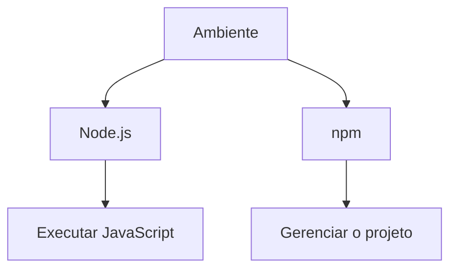

Se algum desses comandos não funcionar, o ambiente ainda não está pronto para continuar.

---

## 4. Verificando o Visual Studio Code

Abra o Visual Studio Code.

Também podemos verificar pelo terminal se o comando `code` está disponível:

```bash
code --version
```

Se o comando funcionar, será exibida a versão instalada.

Caso o comando não esteja disponível no terminal, ainda podemos abrir o VS Code normalmente pelo sistema operacional.

---

## 5. Criando nosso primeiro projeto

obs: Esta sessão será usada somente quando for criar uma projeto do zero.

Agora vamos criar uma pasta para nossos estudos.

Escolha um local no computador e execute:

```bash
mkdir estudos-typescript
```

Depois entre na pasta:

```bash
cd estudos-typescript
```

A partir deste momento, estaremos trabalhando dentro do nosso projeto.

Podemos representar nosso projeto inicialmente assim:

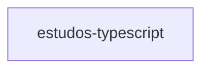

Ainda não temos código.

Estamos apenas preparando o espaço onde o código será desenvolvido.

---

## 6. Abrindo o projeto no VS Code

Dentro da pasta do projeto, execute:

```bash
code .
```

O ponto (`.`) significa:

> abrir a pasta atual.

O VS Code deverá abrir mostrando nossa pasta:

```text
estudos-typescript
```

---

## 7. Criando o projeto npm

Agora vamos inicializar um projeto npm.

No terminal, dentro da pasta do projeto, execute:

```bash
npm init -y
```

Esse comando criará o arquivo:

```text
package.json
```

Nossa estrutura ficará semelhante a:

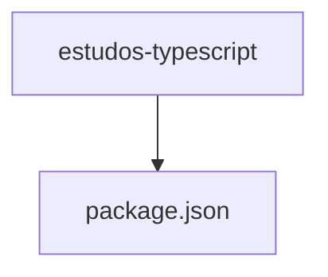

---

## 8. O que é o `package.json`?

O arquivo `package.json` contém informações sobre o nosso projeto.

Ele poderá registrar:

- nome do projeto;
- versão;
- dependências;
- scripts;
- outras configurações.

Neste momento, não precisamos compreender todas as propriedades desse arquivo.

É suficiente entender:

> O `package.json` é um dos principais arquivos de configuração de um projeto npm.

---

## 9. Instalando o TypeScript

Agora vamos instalar o TypeScript como uma dependência de desenvolvimento.

Execute:

```bash
npm install --save-dev typescript
```

Depois da instalação, teremos uma estrutura semelhante a:

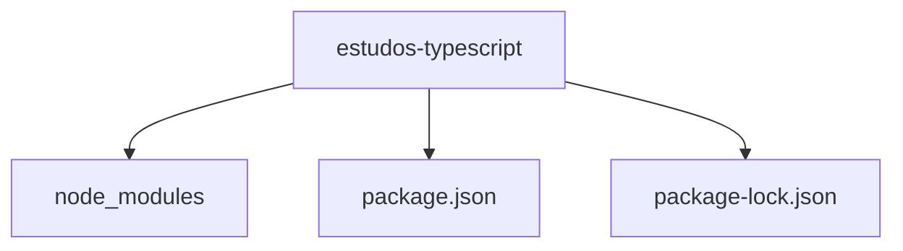

A pasta `node_modules` contém os pacotes instalados pelo npm.

O arquivo `package-lock.json` registra informações relacionadas às versões das dependências instaladas.

---

## 10. Verificando o TypeScript

Podemos verificar se o TypeScript foi instalado corretamente executando:

```bash
npx tsc --version
```

Deverá aparecer algo semelhante a:

```text
Version 5.x.x
```

O número da versão poderá ser diferente.

O comando:

```bash
npx tsc
```

será utilizado para executar o compilador TypeScript instalado no projeto.

---

## 11. Criando o `tsconfig.json`

Agora vamos criar o arquivo de configuração do TypeScript.

Execute:

```bash
npx tsc --init
```

Será criado:

```text
tsconfig.json
```

Nossa estrutura agora será semelhante a:

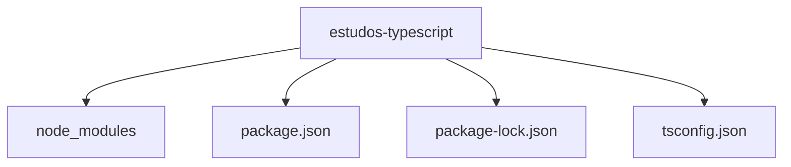

---

## 12. O que é o `tsconfig.json`?

O arquivo `tsconfig.json` informa ao TypeScript como nosso projeto deverá ser compilado.

Ele pode definir configurações relacionadas a:

- versão do JavaScript gerado;
- arquivos que fazem parte do projeto;
- diretório de saída;
- verificação de tipos;
- outras opções do compilador.

Neste tutorial, não precisamos conhecer todas essas opções.

Vamos utilizar apenas o necessário para começar.

---

## 13. Criando a pasta `src`

Agora vamos organizar o código do nosso projeto.

Crie uma pasta chamada:

```text
src
```

Ela será utilizada para armazenar nosso código TypeScript.

Nossa estrutura ficará:

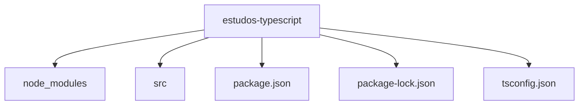

---

## 14. Criando nosso primeiro arquivo TypeScript

Dentro da pasta `src`, crie o arquivo:

```text
index.ts
```

Nossa estrutura agora será:

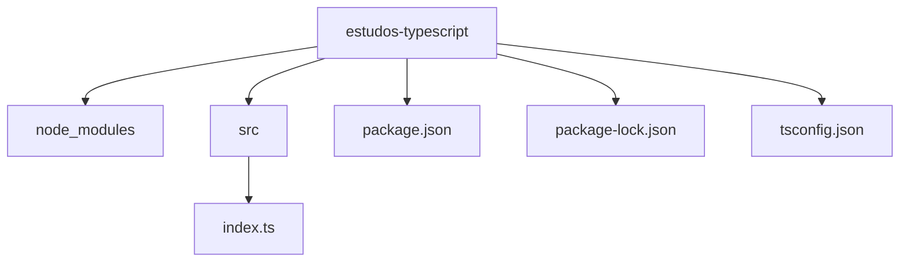

Agora escreva no arquivo `index.ts`:

```typescript
console.log("Olá, TypeScript!");
```

Salve o arquivo.

---

## 15. Compilando o projeto

Agora vamos pedir ao TypeScript para compilar nosso código.

Execute:

```bash
npx tsc
```

Se não houver erros, o comando será concluído sem apresentar mensagens de erro.

O processo que acabamos de executar pode ser representado assim:

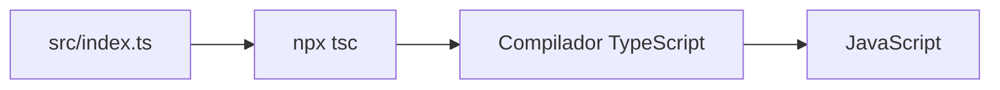

O resultado exato dependerá das configurações presentes no `tsconfig.json`.

---

## 16. TypeScript e JavaScript

É importante compreender uma diferença fundamental.

Nós escrevemos:

```text
index.ts
```

Mas a execução será feita pelo JavaScript.

Podemos visualizar o processo completo:

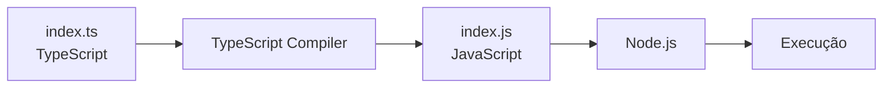

Portanto:

> Escrevemos TypeScript, compilamos para JavaScript e executamos o JavaScript.

---

## 17. Executando o JavaScript

Depois da compilação, precisamos executar o arquivo JavaScript produzido.

A localização do arquivo dependerá da configuração do `tsconfig.json`.

Se o JavaScript tiver sido gerado ao lado do arquivo TypeScript, teremos:

```text
src/
├── index.ts
└── index.js
```

Nesse caso, execute:

```bash
node src/index.js
```

A saída deverá ser:

```text
Olá, TypeScript!
```

Parabéns!

Você acabou de executar seu primeiro programa TypeScript.

---

## 18. Criando a pasta Dist

A pasta dist será reponsável por conter o arquivo javascript compilado que podera ser executado no node.

Crie a pasta dist na raiz do projeto

Abra o arquivos tsconfig.json e descomente as linha abaixo:

```
  "rootDir": "./src",
  "outDir": "./dist",
```

Estas linha configuram respectivamente o local onde o node vai procurar os arquivos fontes e o locl onde ele devera criar o arquivo js compilado.

Faça uma nova compilação dos seu codigo
```bash
npx tsc
```

Execute novamente a partir da pasta dist
```bash
node dist/index.js
```


## 19. Primeiro teste

Agora altere o arquivo `index.ts`.

Escreva:

```typescript
console.log("Meu primeiro programa em TypeScript");
console.log("Estou preparando meu ambiente de estudos");
```

Salve o arquivo.

Depois compile novamente:

```bash
npx tsc
```

E execute o JavaScript gerado.

Você deverá visualizar as duas mensagens no terminal.

---

## 20. Exercício

Agora faça sozinho.

Altere o programa para exibir seu nome.

Por exemplo:

```text
Meu nome é Ana.
```

Depois:

1. salve o arquivo;
2. compile com `npx tsc`;
3. execute o JavaScript com `node`.

O objetivo é praticar o ciclo:

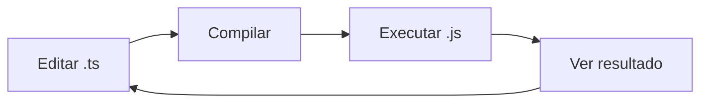

---

## 21. Desafio

Vamos fazer uma pequena sequência de mensagens.

Seu programa deverá apresentar três informações:

```text
Nome:
Curso:
Linguagem que estou estudando:
```

Por exemplo:

```text
Nome: João
Curso: Desenvolvimento de Sistemas
Linguagem que estou estudando: TypeScript
```

Neste momento, não precisamos utilizar variáveis.

O objetivo do desafio é apenas praticar:

- edição do arquivo `.ts`;
- compilação;
- execução.

---

## 22. Conhecendo a estrutura do projeto

Ao final deste tutorial, nosso projeto terá uma estrutura semelhante a:

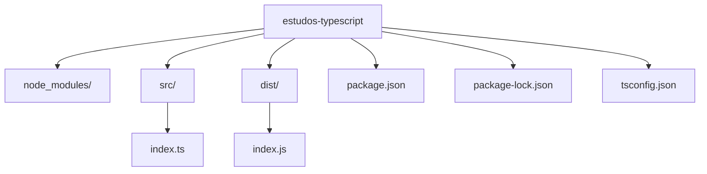

Cada elemento possui uma função.

| Arquivo/Pasta | Função |
|---|---|
| `src/` | código-fonte do projeto |
| `dist/` | código compilado do projeto |
| `index.ts` | nosso código TypeScript |
| `index.js` | JavaScript produzido pela compilação |
| `node_modules/` | dependências instaladas |
| `package.json` | configuração do projeto npm |
| `package-lock.json` | informações das dependências instaladas |
| `tsconfig.json` | configuração do compilador TypeScript |

---

## 24. Exercício de revisão

Responda às perguntas abaixo antes de avançar.

### 1. Qual ferramenta utilizamos para executar JavaScript?

Resposta esperada:

```text
Node.js
```

### 2. Qual ferramenta utilizamos para gerenciar os pacotes do projeto?

Resposta esperada:

```text
npm
```

### 3. Qual extensão utilizamos para arquivos TypeScript?

Resposta:

```text
.ts
```

### 4. Qual comando utilizamos para compilar o projeto?

Resposta:

```bash
npx tsc
```

### 5. Qual arquivo contém as configurações do compilador TypeScript?

Resposta:

```text
tsconfig.json
```

---
