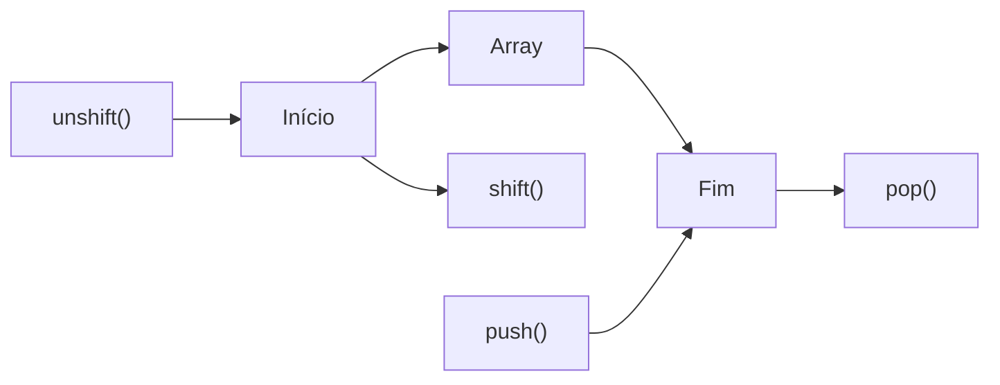

# Tutorial 03 — Modificando Arrays

## Objetivos

Ao final deste tutorial, você deverá ser capaz de:

- alterar elementos de um array;
- adicionar elementos ao final com `push()`;
- remover elementos do final com `pop()`;
- adicionar elementos no início com `unshift()`;
- remover elementos do início com `shift()`;
- combinar essas operações em um pequeno programa;
- observar como o conteúdo de um array muda durante a execução.

Neste tutorial, não vamos repetir conceitos já estudados anteriormente.

No Tutorial 02 já trabalhamos com:

- criação de arrays;
- índices;
- acesso aos elementos;
- `length`;
- compilação;
- execução do programa.

Agora vamos avançar para uma pergunta prática:

> Como podemos modificar um array depois que ele foi criado?

---

## 1. Continuando o projeto

Não crie um novo projeto.

Vamos continuar utilizando o mesmo projeto TypeScript dos tutoriais anteriores.

A estrutura continua semelhante a:

```text
meu-projeto/
├── src/
│   └── index.ts
├── dist/
├── package.json
├── package-lock.json
└── tsconfig.json
```

Vamos continuar trabalhando em:

```text
src/index.ts
```

E o JavaScript compilado continuará sendo gerado em:

```text
dist/index.js
```

Para compilar:

```bash
npx tsc
```

Para executar:

```bash
node dist/index.js
```

---

## 2. O array que vamos utilizar

Vamos começar com uma lista de alunos:

```typescript
const alunos = ["Ana", "Carlos", "João"];

console.log(alunos);
```

O resultado é:

```text
[ 'Ana', 'Carlos', 'João' ]
```

Esse array já foi criado no tutorial anterior.

A diferença agora é que vamos começar a **alterar seu conteúdo**.

---

## 3. Alterando um elemento

Imagine que o nome `"Carlos"` foi digitado incorretamente e deveria ser `"Pedro"`.

Podemos alterar o valor:

```typescript
const alunos = ["Ana", "Carlos", "João"];

alunos[1] = "Pedro";

console.log(alunos);
```

Resultado:

```text
[ 'Ana', 'Pedro', 'João' ]
```

Não criamos outro array.

O mesmo array foi modificado.

Antes:

```text
Ana
Carlos
João
```

Depois:

```text
Ana
Pedro
João
```

A instrução:

```typescript
alunos[1] = "Pedro";
```

significa:

> Coloque `"Pedro"` na posição que anteriormente continha `"Carlos"`.

---

## 4. Podemos alterar mais de um elemento

Podemos modificar várias posições:

```typescript
const alunos = ["Ana", "Carlos", "João"];

alunos[0] = "Maria";
alunos[1] = "Pedro";

console.log(alunos);
```

Resultado:

```text
[ 'Maria', 'Pedro', 'João' ]
```

O importante aqui é perceber que os valores armazenados no array podem ser modificados.

---

## 5. Adicionando elementos com `push()`

Agora temos outro problema.

Nosso array possui:

```typescript
const alunos = ["Ana", "Carlos", "João"];
```

Queremos adicionar mais um aluno:

```text
Maria
```

Podemos utilizar `push()`:

```typescript
const alunos = ["Ana", "Carlos", "João"];

alunos.push("Maria");

console.log(alunos);
```

Resultado:

```text
[ 'Ana', 'Carlos', 'João', 'Maria' ]
```

O `push()` adiciona o novo elemento **no final do array**.

Podemos pensar assim:

```text
Antes:

Ana → Carlos → João

push("Maria")

Depois:

Ana → Carlos → João → Maria
```

---

## 6. Podemos utilizar `push()` várias vezes

O `push()` pode ser utilizado mais de uma vez:

```typescript
const alunos = ["Ana", "Carlos", "João"];

alunos.push("Maria");
alunos.push("Pedro");
alunos.push("Lucas");

console.log(alunos);
```

Resultado:

```text
[ 'Ana', 'Carlos', 'João', 'Maria', 'Pedro', 'Lucas' ]
```

Cada chamada adicionou um novo elemento ao final.

Também podemos adicionar vários elementos em uma única chamada:

```typescript
const alunos = ["Ana", "Carlos", "João"];

alunos.push("Maria", "Pedro", "Lucas");

console.log(alunos);
```

O resultado será:

```text
[ 'Ana', 'Carlos', 'João', 'Maria', 'Pedro', 'Lucas' ]
```

---

## 7. Removendo o último elemento com `pop()`

Agora imagine que o último aluno da lista precisa ser removido.

Podemos usar:

```typescript
pop()
```

Exemplo:

```typescript
const alunos = ["Ana", "Carlos", "João", "Maria"];

alunos.pop();

console.log(alunos);
```

Resultado:

```text
[ 'Ana', 'Carlos', 'João' ]
```

O `pop()` remove o último elemento do array.

Podemos visualizar:

```text
Antes:

Ana → Carlos → João → Maria

pop()

Depois:

Ana → Carlos → João
```

---

## 8. `push()` e `pop()` trabalham em lados opostos

Podemos comparar:

```typescript
alunos.push("Maria");
```

com:

```typescript
alunos.pop();
```

O primeiro adiciona no final.

O segundo remove do final.

```text
            FINAL
              |
              v
Ana → Carlos → João

push("Maria")
              ↓
Ana → Carlos → João → Maria

pop()
              ↓
Ana → Carlos → João
```

Essas duas operações formam uma das maneiras mais simples de modificar o final de um array.

---

## 9. Adicionando no início com `unshift()`

Agora queremos adicionar um aluno no **início** da lista.

Podemos usar:

```typescript
unshift()
```

Exemplo:

```typescript
const alunos = ["Ana", "Carlos", "João"];

alunos.unshift("Maria");

console.log(alunos);
```

Resultado:

```text
[ 'Maria', 'Ana', 'Carlos', 'João' ]
```

Diferentemente do `push()`, o `unshift()` adiciona o elemento no início.

```text
Antes:

Ana → Carlos → João

unshift("Maria")

Depois:

Maria → Ana → Carlos → João
```

---

## 10. Removendo do início com `shift()`

Para remover o primeiro elemento, usamos:

```typescript
shift()
```

Exemplo:

```typescript
const alunos = ["Ana", "Carlos", "João"];

alunos.shift();

console.log(alunos);
```

Resultado:

```text
[ 'Carlos', 'João' ]
```

O primeiro elemento foi removido.

```text
Antes:

Ana → Carlos → João

shift()

Depois:

Carlos → João
```

---

## 11. Comparando as quatro operações

Agora já conhecemos quatro operações fundamentais:

| Método | Ação | Local |
|---|---|---|
| `push()` | adiciona | final |
| `pop()` | remove | final |
| `unshift()` | adiciona | início |
| `shift()` | remove | início |

Podemos representar:



A ideia principal é:

```text
início                      final
  ↓                           ↓
unshift()                 push()
shift()                   pop()
```

---

## 12. Fazendo o código crescer

Agora vamos juntar as operações no mesmo programa.

Começamos:

```typescript
const alunos = ["Ana", "Carlos", "João"];

console.log(alunos);
```

Adicionamos Maria no final:

```typescript
const alunos = ["Ana", "Carlos", "João"];

alunos.push("Maria");

console.log(alunos);
```

Depois adicionamos Pedro no início:

```typescript
const alunos = ["Ana", "Carlos", "João"];

alunos.push("Maria");
alunos.unshift("Pedro");

console.log(alunos);
```

Agora alteramos um elemento:

```typescript
const alunos = ["Ana", "Carlos", "João"];

alunos.push("Maria");
alunos.unshift("Pedro");

alunos[2] = "Lucas";

console.log(alunos);
```

O array passou por várias transformações.

Isso é importante porque estamos começando a trabalhar com uma situação mais próxima de um programa real:

```text
criar lista
   ↓
adicionar dados
   ↓
adicionar mais dados
   ↓
alterar dados
   ↓
remover dados
```

---

## 13. Removendo elementos

Vamos continuar o mesmo exemplo:

```typescript
const alunos = ["Ana", "Carlos", "João"];

alunos.push("Maria");
alunos.unshift("Pedro");

alunos[2] = "Lucas";

console.log("Antes das remoções:", alunos);

alunos.pop();

console.log("Depois do pop:", alunos);

alunos.shift();

console.log("Depois do shift:", alunos);
```

Resultado:

```text
Antes das remoções: [ 'Pedro', 'Ana', 'Lucas', 'Maria' ]
Depois do pop: [ 'Pedro', 'Ana', 'Lucas' ]
Depois do shift: [ 'Ana', 'Lucas' ]
```

Observe que o array vai sendo modificado passo a passo.

---

## 14. O mesmo array durante toda a execução

É importante perceber que continuamos trabalhando com:

```typescript
const alunos
```

Mesmo usando `const`, podemos modificar o conteúdo do array:

```typescript
const alunos = ["Ana", "Carlos"];

alunos.push("João");
alunos[0] = "Maria";
alunos.pop();
```

O que não podemos fazer é atribuir outro array à variável:

```typescript
const alunos = ["Ana", "Carlos"];

alunos = ["Pedro", "João"];
```

Esse tipo de atribuição não é permitido porque `alunos` foi declarado com `const`.

Mas modificar os elementos do array é permitido.

Essa diferença será importante conforme nossos programas forem ficando maiores.

---

## 15. Um pequeno programa completo

Vamos agora reunir tudo em um único exemplo.

Substitua o conteúdo do `src/index.ts` por:

```typescript
const alunos = ["Ana", "Carlos", "João"];

console.log("Lista inicial:", alunos);

// Adiciona no final
alunos.push("Maria");

console.log("Depois do push:", alunos);

// Adiciona no início
alunos.unshift("Pedro");

console.log("Depois do unshift:", alunos);

// Altera um elemento
alunos[2] = "Lucas";

console.log("Depois da alteração:", alunos);

// Remove o último
alunos.pop();

console.log("Depois do pop:", alunos);

// Remove o primeiro
alunos.shift();

console.log("Depois do shift:", alunos);
```

Agora compile:

```bash
npx tsc
```

E execute:

```bash
node dist/index.js
```

O resultado será:

```text
Lista inicial: [ 'Ana', 'Carlos', 'João' ]
Depois do push: [ 'Ana', 'Carlos', 'João', 'Maria' ]
Depois do unshift: [ 'Pedro', 'Ana', 'Carlos', 'João', 'Maria' ]
Depois da alteração: [ 'Pedro', 'Ana', 'Lucas', 'João', 'Maria' ]
Depois do pop: [ 'Pedro', 'Ana', 'Lucas', 'João' ]
Depois do shift: [ 'Ana', 'Lucas', 'João' ]
```

Agora temos um programa que efetivamente manipula uma lista.

---

## 16. Exercício

Crie o seguinte array:

```typescript
const frutas = ["Maçã", "Banana", "Laranja"];
```

Faça as seguintes operações, nesta ordem:

1. altere `"Banana"` para `"Manga"`;
2. adicione `"Uva"` no final;
3. adicione `"Abacaxi"` no início;
4. remova o último elemento;
5. remova o primeiro elemento;
6. mostre o resultado final.

Tente fazer o exercício sem consultar a solução.

### Solução

Uma possível solução é:

```typescript
const frutas = ["Maçã", "Banana", "Laranja"];

frutas[1] = "Manga";

frutas.push("Uva");

frutas.unshift("Abacaxi");

frutas.pop();

frutas.shift();

console.log(frutas);
```

Resultado:

```text
[ 'Maçã', 'Manga', 'Laranja' ]
```

---

## 17. Desafio

Agora crie:

```typescript
const numeros = [10, 20, 30];
```

Faça o array passar pelas seguintes transformações:

```text
[10, 20, 30]

[10, 25, 30]

[10, 25, 30, 40]

[5, 10, 25, 30, 40]

[5, 10, 25, 30]
```

Você deverá utilizar:

- alteração de elemento;
- `push()`;
- `unshift()`;
- `pop()`.

Não utilize outro método.

---

## 18. O que aprendemos?

Neste tutorial, começamos a modificar um array que já conhecíamos.

Aprendemos:

### Alterar

```typescript
alunos[1] = "Pedro";
```

### Adicionar no final

```typescript
alunos.push("Maria");
```

### Remover do final

```typescript
alunos.pop();
```

### Adicionar no início

```typescript
alunos.unshift("Maria");
```

### Remover do início

```typescript
alunos.shift();
```

A partir dessas operações, já conseguimos realizar alterações básicas em uma lista.

---

## 19. Checklist

Antes de avançar para o próximo tutorial, verifique se você consegue:

- [ ] alterar um elemento de um array;
- [ ] adicionar um elemento no final com `push()`;
- [ ] remover o último elemento com `pop()`;
- [ ] adicionar um elemento no início com `unshift()`;
- [ ] remover o primeiro elemento com `shift()`;
- [ ] explicar a diferença entre `push()` e `unshift()`;
- [ ] explicar a diferença entre `pop()` e `shift()`;
- [ ] combinar várias operações no mesmo array;
- [ ] explicar por que podemos modificar um array declarado com `const`;
- [ ] compilar o programa com `npx tsc`;
- [ ] executar o JavaScript gerado em `dist`.

---

## Próximo tutorial

No próximo tutorial vamos estudar **arrays tipados em TypeScript**.

Até agora trabalhamos com arrays sem declarar explicitamente seus tipos:

```typescript
const alunos = ["Ana", "Carlos", "João"];
```

Agora vamos investigar como o TypeScript trata os tipos desses elementos.

Vamos trabalhar com:

```typescript
string[]
number[]
boolean[]
Array<T>
```

e entender como a inferência de tipos funciona.
