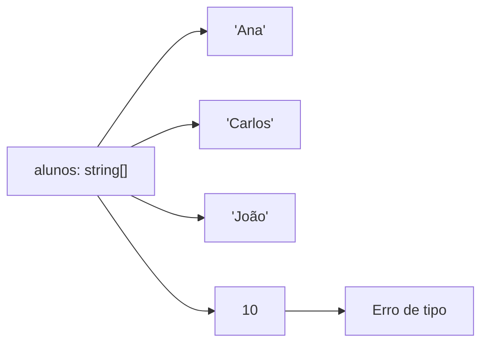
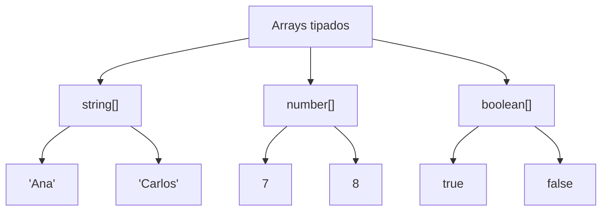
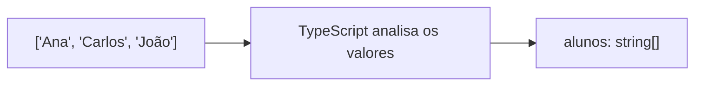
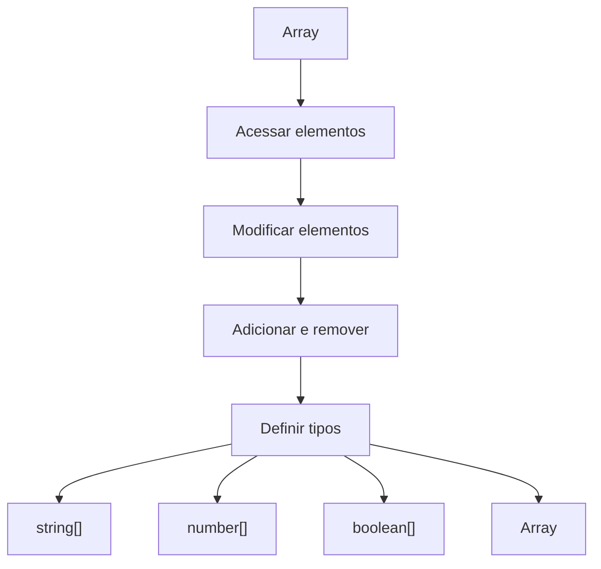

# Tutorial 04 — Arrays tipados em TypeScript

## Objetivos

Ao final deste tutorial, você deverá ser capaz de:

- compreender o que significa tipar um array;
- declarar arrays de `string`;
- declarar arrays de `number`;
- declarar arrays de `boolean`;
- utilizar `Array<T>`;
- compreender a inferência de tipos;
- perceber como o TypeScript impede valores incompatíveis em um array.

---

## 1. Continuando o projeto

Não vamos criar um novo projeto.

Vamos continuar utilizando o mesmo projeto TypeScript dos tutoriais anteriores.

A estrutura continua semelhante a:

```text
meu-projeto/
├── src/
│   └── index.ts
├── dist/
├── package.json
├── package-lock.json
└── tsconfig.json
```

Vamos continuar trabalhando em:

```text
src/index.ts
```

O JavaScript compilado continuará sendo gerado em:

```text
dist/index.js
```

Para compilar:

```bash
npx tsc
```

Para executar:

```bash
node dist/index.js
```

Nos tutoriais anteriores, aprendemos a criar arrays e a modificá-los. Agora vamos entender uma característica importante do TypeScript: **os tipos dos elementos que um array pode armazenar**.

---

## 2. Começando com um array de nomes

Vamos começar com um exemplo que já conhecemos.

No arquivo:

```text
src/index.ts
```

coloque:

```typescript
const alunos = ["Ana", "Carlos", "João"];

console.log(alunos);
```

Compile:

```bash
npx tsc
```

Execute:

```bash
node dist/index.js
```

O resultado será semelhante a:

```text
[ 'Ana', 'Carlos', 'João' ]
```

Até aqui, o código parece igual ao dos tutoriais anteriores.

Mas existe uma informação importante que o TypeScript já consegue descobrir sozinho.

Todos os elementos desse array são `string`.

Podemos representar isso assim:

```text
alunos
  |
  +-- "Ana"     string
  +-- "Carlos"  string
  +-- "João"    string
```

O TypeScript consegue **inferir** esse tipo a partir dos valores que colocamos no array.

---

## 3. O que significa tipar um array?

Podemos informar explicitamente ao TypeScript qual tipo de valor o array deverá armazenar.

Por exemplo:

```typescript
const alunos: string[] = [
    "Ana",
    "Carlos",
    "João"
];

console.log(alunos);
```

Observe a parte:

```typescript
string[]
```

Ela significa:

> Este é um array de `string`.

Podemos visualizar:

```text
string[]
  |
  +-- string
  +-- string
  +-- string
```

Nesse caso, os elementos do array precisam ser textos.

Compile:

```bash
npx tsc
```

E execute:

```bash
node dist/index.js
```

O resultado continua sendo:

```text
[ 'Ana', 'Carlos', 'João' ]
```

A diferença está na informação de tipo que o TypeScript possui sobre o array.

---

## 4. Tentando colocar um número no array

Agora vamos experimentar o que acontece quando tentamos colocar um valor de outro tipo.

Altere o código para:

```typescript
const alunos: string[] = [
    "Ana",
    "Carlos",
    "João"
];

alunos.push(10);

console.log(alunos);
```

Tente compilar:

```bash
npx tsc
```

O TypeScript deverá apresentar um erro.

O motivo é que `alunos` foi declarado como:

```typescript
string[]
```

Portanto, o array aceita:

```text
string
```

mas não aceita:

```text
number
```

Podemos pensar assim:



O TypeScript está verificando se o valor que estamos tentando adicionar é compatível com o tipo declarado.

Agora remova a linha:

```typescript
alunos.push(10);
```

e deixe novamente:

```typescript
const alunos: string[] = [
    "Ana",
    "Carlos",
    "João"
];

console.log(alunos);
```

Compile novamente:

```bash
npx tsc
```

---

## 5. Arrays de números

Até agora trabalhamos com `string`.

Também podemos criar arrays de números.

Substitua o código por:

```typescript
const notas: number[] = [
    7,
    8,
    6,
    9,
    10
];

console.log(notas);
```

Observe:

```typescript
number[]
```

Isso significa:

> Este é um array de `number`.

Compile:

```bash
npx tsc
```

Execute:

```bash
node dist/index.js
```

O resultado será:

```text
[ 7, 8, 6, 9, 10 ]
```

Podemos continuar utilizando as operações que aprendemos anteriormente.

Por exemplo:

```typescript
const notas: number[] = [
    7,
    8,
    6,
    9,
    10
];

notas.push(8);

console.log(notas);
```

O número `8` pode ser adicionado porque é um `number`.

Agora experimente:

```typescript
notas.push("10");
```

Compile novamente.

O TypeScript deverá indicar um erro porque:

```text
"10" → string
10   → number
```

Embora os dois valores representem algo que visualmente parece semelhante, para o TypeScript eles são tipos diferentes.

---

## 6. String e number são tipos diferentes

Observe estes dois valores:

```typescript
const numero = 10;
const texto = "10";
```

Eles não possuem o mesmo tipo.

```text
10
↓
number
```

e:

```text
"10"
↓
string
```

Isso também se aplica aos arrays.

Podemos ter:

```typescript
const numeros: number[] = [10, 20, 30];
```

e:

```typescript
const textos: string[] = ["10", "20", "30"];
```

Apesar dos valores parecerem semelhantes, os arrays armazenam tipos diferentes.

---

## 7. Arrays de boolean

Também podemos criar arrays de valores booleanos.

Um `boolean` possui apenas dois valores:

```text
true
false
```

Vamos experimentar.

Substitua o código por:

```typescript
const respostas: boolean[] = [
    true,
    false,
    true
];

console.log(respostas);
```

Compile:

```bash
npx tsc
```

Execute:

```bash
node dist/index.js
```

Resultado:

```text
[ true, false, true ]
```

A declaração:

```typescript
boolean[]
```

significa:

> Este é um array de valores booleanos.

Portanto:

```typescript
const respostas: boolean[] = [
    true,
    false
];
```

é válido.

Mas:

```typescript
const respostas: boolean[] = [
    true,
    "false"
];
```

não é válido porque:

```text
true     → boolean
"false"  → string
```

---

## 8. Três tipos de arrays

Agora conhecemos três formas comuns de tipar arrays:

```typescript
const alunos: string[] = [
    "Ana",
    "Carlos"
];

const notas: number[] = [
    7,
    8,
    9
];

const aprovados: boolean[] = [
    true,
    false,
    true
];
```

Podemos representar:



A ideia principal é:

```text
string[]   → array de textos
number[]   → array de números
boolean[]  → array de valores true/false
```

---

## 9. Outra forma de declarar: `Array<T>`

Existe outra sintaxe para declarar arrays tipados.

Em vez de:

```typescript
string[]
```

podemos escrever:

```typescript
Array<string>
```

Por exemplo:

```typescript
const alunos: Array<string> = [
    "Ana",
    "Carlos",
    "João"
];

console.log(alunos);
```

Essa declaração representa o mesmo conceito de:

```typescript
const alunos: string[] = [
    "Ana",
    "Carlos",
    "João"
];
```

Também podemos escrever:

```typescript
const notas: Array<number> = [
    7,
    8,
    9
];
```

e:

```typescript
const respostas: Array<boolean> = [
    true,
    false
];
```

Podemos fazer a seguinte correspondência:

```text
string[]       = Array<string>
number[]       = Array<number>
boolean[]      = Array<boolean>
```

As duas formas são utilizadas em TypeScript.

---

## 10. Comparando as duas formas

Vamos observar:

```typescript
const alunos1: string[] = [
    "Ana",
    "Carlos"
];

const alunos2: Array<string> = [
    "Ana",
    "Carlos"
];
```

Os dois arrays possuem o mesmo tipo de elemento:

```text
string
```

A diferença está apenas na forma de escrever a declaração.

Para os exemplos desta série, vamos utilizar principalmente:

```typescript
string[]
number[]
boolean[]
```

porque essa forma é curta e fácil de visualizar.

É importante, porém, reconhecer `Array<T>` quando encontrarmos essa sintaxe em outros códigos.

---

## 11. Inferência de tipos

Até agora vimos que podemos declarar explicitamente o tipo:

```typescript
const alunos: string[] = [
    "Ana",
    "Carlos",
    "João"
];
```

Mas também podemos simplesmente escrever:

```typescript
const alunos = [
    "Ana",
    "Carlos",
    "João"
];
```

Nesse caso, o TypeScript analisa os valores e infere o tipo.

Como todos os elementos são strings, o TypeScript entende que:

```text
alunos
  ↓
string[]
```

Podemos representar:



Isso é chamado de **inferência de tipos**.

O TypeScript consegue descobrir o tipo sem que precisemos escrevê-lo explicitamente.

---

## 12. Inferência também acontece com números

Observe:

```typescript
const notas = [
    7,
    8,
    9
];
```

O TypeScript consegue inferir:

```text
notas: number[]
```

Portanto, podemos utilizar:

```typescript
notas.push(10);
```

porque `10` é um `number`.

Mas:

```typescript
notas.push("10");
```

não é compatível com o tipo inferido.

---

## 13. Então precisamos sempre escrever o tipo?

Não.

Quando o TypeScript consegue inferir corretamente o tipo, não é obrigatório escrever:

```typescript
const alunos: string[] = [
    "Ana",
    "Carlos"
];
```

Podemos escrever:

```typescript
const alunos = [
    "Ana",
    "Carlos"
];
```

O TypeScript consegue inferir:

```text
string[]
```

Neste tutorial, porém, vamos utilizar declarações explícitas em vários exemplos porque elas ajudam a visualizar o conceito que estamos estudando.

O objetivo é aprender a reconhecer:

```typescript
string[]
number[]
boolean[]
Array<string>
Array<number>
Array<boolean>
```

e também entender quando o TypeScript consegue descobrir o tipo sozinho.

---

## 14. O tipo acompanha as operações

Vamos juntar o que aprendemos nos tutoriais anteriores com os tipos.

Começamos:

```typescript
const alunos: string[] = [
    "Ana",
    "Carlos",
    "João"
];

console.log(alunos);
```

Agora podemos adicionar um aluno:

```typescript
const alunos: string[] = [
    "Ana",
    "Carlos",
    "João"
];

alunos.push("Maria");

console.log(alunos);
```

Podemos alterar um elemento:

```typescript
const alunos: string[] = [
    "Ana",
    "Carlos",
    "João"
];

alunos.push("Maria");

alunos[1] = "Pedro";

console.log(alunos);
```

Também podemos remover:

```typescript
const alunos: string[] = [
    "Ana",
    "Carlos",
    "João"
];

alunos.push("Maria");

alunos[1] = "Pedro";

alunos.pop();

console.log(alunos);
```

Continuamos utilizando as operações aprendidas no Tutorial 03.

A novidade é que agora sabemos exatamente qual tipo de valor o array deve armazenar.

---

## 15. Um pequeno programa completo

Vamos reunir os conceitos em um único programa.

Substitua o conteúdo do `src/index.ts` por:

```typescript
const alunos: string[] = [
    "Ana",
    "Carlos",
    "João"
];

console.log("Lista inicial:", alunos);

alunos.push("Maria");

console.log("Depois do push:", alunos);

alunos[1] = "Pedro";

console.log("Depois da alteração:", alunos);

alunos.unshift("Lucas");

console.log("Depois do unshift:", alunos);

alunos.pop();

console.log("Depois do pop:", alunos);
```

Compile:

```bash
npx tsc
```

Execute:

```bash
node dist/index.js
```

O resultado será semelhante a:

```text
Lista inicial: [ 'Ana', 'Carlos', 'João' ]
Depois do push: [ 'Ana', 'Carlos', 'João', 'Maria' ]
Depois da alteração: [ 'Ana', 'Pedro', 'João', 'Maria' ]
Depois do unshift: [ 'Lucas', 'Ana', 'Pedro', 'João', 'Maria' ]
Depois do pop: [ 'Lucas', 'Ana', 'Pedro', 'João' ]
```

Observe que continuamos utilizando:

```text
índice
push()
pop()
unshift()
```

que já foram estudados.

A novidade deste tutorial é:

```typescript
const alunos: string[]
```

O array agora possui um tipo explícito.

---

## 16. O TypeScript protege nosso array

Vamos fazer uma experiência.

Depois do código anterior, acrescente:

```typescript
alunos.push(100);
```

O arquivo ficará semelhante a:

```typescript
const alunos: string[] = [
    "Ana",
    "Carlos",
    "João"
];

alunos.push("Maria");

alunos[1] = "Pedro";

alunos.unshift("Lucas");

alunos.pop();

console.log(alunos);

alunos.push(100);
```

Agora compile:

```bash
npx tsc
```

O TypeScript deverá indicar um erro.

Isso acontece porque:

```text
alunos → string[]
100    → number
```

O valor `100` não é compatível com o tipo do array.

Remova a linha:

```typescript
alunos.push(100);
```

Compile novamente:

```bash
npx tsc
```

O erro deverá desaparecer.

---

## 17. O que o tipo nos ajuda a perceber?

Imagine que estamos trabalhando com:

```typescript
const notas: number[] = [
    7,
    8,
    9
];
```

Quando vemos:

```typescript
notas
```

já sabemos que esperamos números.

Quando vemos:

```typescript
notas.push(10);
```

sabemos que o valor é compatível.

Quando vemos:

```typescript
notas.push("10");
```

podemos perceber que existe um problema de tipo.

Essa informação será cada vez mais importante conforme nossos arrays ficarem maiores e passarem a armazenar objetos.

---

## 18. Exercício 1 — Array de nomes

Crie um array chamado `nomes` contendo:

```text
Ana
Carlos
Maria
João
```

Declare explicitamente o tipo como:

```typescript
string[]
```

Depois:

1. mostre o array;
2. adicione `"Pedro"` no final;
3. altere `"Carlos"` para `"Lucas"`;
4. remova o último elemento;
5. mostre o resultado final.

Utilize apenas os conceitos estudados até agora.

---

## 19. Exercício 2 — Array de números

Crie:

```typescript
const numeros: number[] = [
    10,
    20,
    30
];
```

Depois:

1. adicione `40` no final;
2. adicione `5` no início;
3. altere `20` para `25`;
4. remova o último elemento;
5. mostre o array final.

Depois tente adicionar:

```typescript
numeros.push("50");
```

Compile e observe o erro.

Em seguida, remova essa linha e compile novamente.

---

## 20. Exercício 3 — Array de booleanos

Crie:

```typescript
const respostas: boolean[] = [
    true,
    false,
    true
];
```

Depois:

1. mostre o array;
2. adicione `false` no final;
3. altere o segundo elemento;
4. remova o primeiro elemento;
5. mostre o resultado final.

Depois tente adicionar:

```typescript
respostas.push("true");
```

Compile e observe o erro.

Pergunte a si mesmo:

> Por que `"true"` não pode ser colocado em um `boolean[]`?

---

## 21. Exercício 4 — `Array<T>`

Agora escreva os mesmos exemplos utilizando `Array<T>`.

Crie:

```typescript
const nomes: Array<string> = [
    "Ana",
    "Carlos"
];

const numeros: Array<number> = [
    10,
    20
];

const respostas: Array<boolean> = [
    true,
    false
];
```

Mostre os três arrays no terminal.

O objetivo deste exercício é reconhecer que:

```typescript
string[]
```

e:

```typescript
Array<string>
```

representam o mesmo tipo de array.

---

## 22. Desafio — Misturando tipos de propósito

Crie três arrays:

```typescript
const nomes: string[] = [
    "Ana",
    "Carlos",
    "Maria"
];

const idades: number[] = [
    20,
    22,
    19
];

const aprovados: boolean[] = [
    true,
    false,
    true
];
```

Depois mostre:

```text
Nomes:
Idades:
Aprovados:
```

Em seguida:

1. adicione um novo nome;
2. adicione uma nova idade;
3. adicione um novo resultado de aprovação;
4. altere uma idade;
5. altere um resultado de aprovação;
6. remova o último nome;
7. mostre os três arrays novamente.

Não crie objetos ainda.

O objetivo é praticar arrays tipados.

---

## 23. Nosso código até aqui

Ao longo da série, estamos construindo o conhecimento passo a passo.

Até agora:

```text
Array
  ↓
índices
  ↓
length
  ↓
acesso aos elementos
  ↓
alteração
  ↓
push()
  ↓
pop()
  ↓
unshift()
  ↓
shift()
  ↓
tipos dos elementos
```

Podemos visualizar a evolução:



O próximo passo será continuar trabalhando com operações de arrays.

---

## 24. O que aprendemos?

Neste tutorial aprendemos que podemos declarar arrays tipados utilizando:

### Array de strings

```typescript
const alunos: string[] = [
    "Ana",
    "Carlos"
];
```

### Array de números

```typescript
const notas: number[] = [
    7,
    8,
    9
];
```

### Array de booleanos

```typescript
const respostas: boolean[] = [
    true,
    false
];
```

### Sintaxe `Array<T>`

```typescript
const alunos: Array<string> = [
    "Ana",
    "Carlos"
];
```

Também aprendemos que o TypeScript pode inferir o tipo:

```typescript
const alunos = [
    "Ana",
    "Carlos"
];
```

Nesse caso, o TypeScript consegue inferir que:

```text
alunos → string[]
```

E vimos que o tipo ajuda o TypeScript a identificar valores incompatíveis.

---

## 25. Checklist

Antes de avançar para o próximo tutorial, verifique se você consegue:

- [ ] explicar o que significa `string[]`;
- [ ] criar um array de `string`;
- [ ] criar um array de `number`;
- [ ] criar um array de `boolean`;
- [ ] explicar o que significa `Array<T>`;
- [ ] escrever `Array<string>`;
- [ ] escrever `Array<number>`;
- [ ] escrever `Array<boolean>`;
- [ ] explicar a diferença entre `10` e `"10"`;
- [ ] explicar o que é inferência de tipos;
- [ ] perceber quando um valor é incompatível com o tipo do array;
- [ ] utilizar `push()` em um array tipado;
- [ ] utilizar `pop()` em um array tipado;
- [ ] utilizar `unshift()` em um array tipado;
- [ ] utilizar índices para modificar elementos;
- [ ] compilar o programa com `npx tsc`;
- [ ] executar o JavaScript gerado em `dist`.

---

## Próximo tutorial

No próximo tutorial vamos continuar trabalhando com arrays e aprofundar o acesso e a alteração dos seus elementos.

Vamos utilizar os conhecimentos que já temos sobre:

```text
índices
length
arrays tipados
```

para trabalhar de forma mais consciente com as posições dos elementos.
