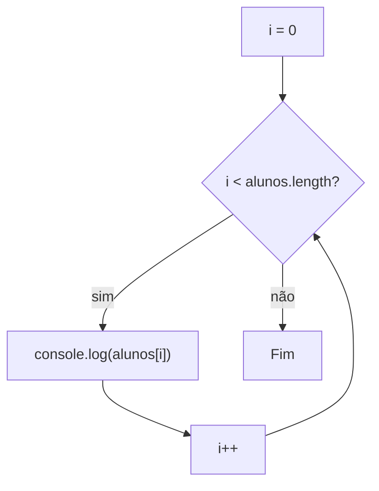

# Tutorial 05 — Percorrendo Arrays em TypeScript

## Objetivos

Ao final deste tutorial, você deverá ser capaz de:

- percorrer todos os elementos de um array;
- utilizar `for`;
- utilizar `for...of`;
- utilizar `forEach`;
- entender a diferença entre essas três formas;
- escolher uma forma adequada para cada situação;
- construir um programa que trabalha com todos os elementos de um array.

## 1. Continuando o projeto

Não vamos criar um novo projeto.

Vamos continuar utilizando o mesmo projeto TypeScript dos tutoriais anteriores.

A estrutura continua:

```text
estudos-typescript/
├── src/
│   └── index.ts
├── dist/
│   └── index.js
├── package.json
├── package-lock.json
└── tsconfig.json
```

Vamos continuar trabalhando em:

```text
src/index.ts
```

O JavaScript compilado continuará sendo gerado em:

```text
dist/index.js
```

Para compilar:

```bash
npx tsc
```

Para executar:

```bash
node dist/index.js
```

Não vamos criar um arquivo para cada exemplo. O programa vai crescer dentro do mesmo `src/index.ts`.

---

# 2. O problema

Nos tutoriais anteriores, aprendemos a acessar elementos individualmente.

Por exemplo:

```typescript
const alunos = ["Ana", "Carlos", "João", "Maria"];

console.log(alunos[0]);
console.log(alunos[1]);
console.log(alunos[2]);
console.log(alunos[3]);
```

Isso funciona.

Mas imagine um array com 100 alunos. Teríamos que escrever uma instrução para cada posição.

Precisamos de uma maneira de dizer:

> Passe por todos os elementos do array.

É exatamente isso que significa **percorrer um array**.

---

# 3. Percorrendo com `for`

Vamos começar com a estrutura `for`.

Substitua o conteúdo do `src/index.ts` por:

```typescript
const alunos = ["Ana", "Carlos", "João", "Maria"];

for (let i = 0; i < alunos.length; i++) {
    console.log(alunos[i]);
}
```

Compile:

```bash
npx tsc
```

Execute:

```bash
node dist/index.js
```

O resultado será:

```text
Ana
Carlos
João
Maria
```

Agora não precisamos escrever um `console.log()` para cada aluno.

---

# 4. Entendendo o `for`

Vamos observar novamente:

```typescript
for (let i = 0; i < alunos.length; i++) {
    console.log(alunos[i]);
}
```

O `for` possui três partes principais:

```text
for (
    inicialização;
    condição;
    incremento
)
```

No nosso exemplo:

```typescript
let i = 0
```

começamos pelo índice `0`.

Depois:

```typescript
i < alunos.length
```

enquanto o índice for menor que a quantidade de elementos, continuamos repetindo.

E:

```typescript
i++
```

aumenta o índice em `1` a cada repetição.



---

# 5. Acompanhe os índices

Nosso array é:

```typescript
const alunos = ["Ana", "Carlos", "João", "Maria"];
```

Durante o `for`, o valor de `i` muda:

```text
i = 0 → alunos[0] → Ana
i = 1 → alunos[1] → Carlos
i = 2 → alunos[2] → João
i = 3 → alunos[3] → Maria
```

Depois:

```text
i = 4
```

A condição deixa de ser verdadeira:

```text
4 < 4
```

Então o `for` termina.

---

# 6. O tamanho do array pode mudar

Não precisamos conhecer antecipadamente a quantidade de elementos.

Podemos ter:

```typescript
const alunos = ["Ana", "Carlos", "João"];

for (let i = 0; i < alunos.length; i++) {
    console.log(alunos[i]);
}
```

Se depois tivermos:

```typescript
const alunos = [
    "Ana",
    "Carlos",
    "João",
    "Maria",
    "Pedro",
    "Lucas"
];

for (let i = 0; i < alunos.length; i++) {
    console.log(alunos[i]);
}
```

o mesmo `for` continua funcionando.

Isso acontece porque usamos `alunos.length` em vez de uma quantidade fixa.

---

# 7. Mostrando o índice junto com o valor

Como temos acesso ao índice, podemos mostrar as duas informações:

```typescript
const alunos = ["Ana", "Carlos", "João", "Maria"];

for (let i = 0; i < alunos.length; i++) {
    console.log("Índice:", i, "Aluno:", alunos[i]);
}
```

Resultado:

```text
Índice: 0 Aluno: Ana
Índice: 1 Aluno: Carlos
Índice: 2 Aluno: João
Índice: 3 Aluno: Maria
```

---

# 8. Percorrendo com `for...of`

Existe outra maneira de percorrer um array: `for...of`.

```typescript
const alunos = ["Ana", "Carlos", "João", "Maria"];

for (const aluno of alunos) {
    console.log(aluno);
}
```

O resultado será:

```text
Ana
Carlos
João
Maria
```

No `for` tradicional trabalhamos diretamente com o índice:

```typescript
alunos[i]
```

No `for...of`, recebemos diretamente o elemento:

```typescript
aluno
```

---

# 9. Quando `for...of` fica mais simples

Compare:

```typescript
for (let i = 0; i < alunos.length; i++) {
    console.log(alunos[i]);
}
```

com:

```typescript
for (const aluno of alunos) {
    console.log(aluno);
}
```

Quando precisamos apenas dos valores, o `for...of` deixa o código mais direto.

---

# 10. E se precisarmos do índice?

Nesse caso, o `for` tradicional pode ser mais conveniente:

```typescript
for (let i = 0; i < alunos.length; i++) {
    console.log(i, alunos[i]);
}
```

Podemos pensar:

```text
Preciso do índice?
    ↓
for pode ser uma boa opção

Preciso apenas do elemento?
    ↓
for...of pode ser uma boa opção
```

---

# 11. Percorrendo com `forEach`

Existe ainda uma terceira forma bastante comum:

```typescript
forEach()
```

```typescript
const alunos = ["Ana", "Carlos", "João", "Maria"];

alunos.forEach(aluno => {
    console.log(aluno);
});
```

O resultado será:

```text
Ana
Carlos
João
Maria
```

O `forEach()` executa uma função para cada elemento do array.

---

# 12. Entendendo a função do `forEach`

Neste código:

```typescript
alunos.forEach(aluno => {
    console.log(aluno);
});
```

`aluno => { ... }` é uma função que será executada para cada elemento.

Podemos imaginar:

```text
Ana
 ↓
executa a função

Carlos
 ↓
executa a função

João
 ↓
executa a função

Maria
 ↓
executa a função
```

---

# 13. `forEach` também pode fornecer o índice

Podemos receber o índice como segundo parâmetro:

```typescript
const alunos = ["Ana", "Carlos", "João", "Maria"];

alunos.forEach((aluno, indice) => {
    console.log("Índice:", indice, "Aluno:", aluno);
});
```

Resultado:

```text
Índice: 0 Aluno: Ana
Índice: 1 Aluno: Carlos
Índice: 2 Aluno: João
Índice: 3 Aluno: Maria
```

Agora temos o elemento e o índice disponíveis dentro da função.

---

# 14. Comparando as três formas

## `for`

```typescript
for (let i = 0; i < alunos.length; i++) {
    console.log(alunos[i]);
}
```

Temos controle explícito do índice.

## `for...of`

```typescript
for (const aluno of alunos) {
    console.log(aluno);
}
```

Recebemos diretamente cada elemento.

## `forEach`

```typescript
alunos.forEach(aluno => {
    console.log(aluno);
});
```

Executamos uma função para cada elemento.

| Forma | Elemento | Índice |
|---|---|---|
| `for` | `alunos[i]` | `i` |
| `for...of` | `aluno` | não diretamente |
| `forEach` | `aluno` | segundo parâmetro |

---

# 15. Fazendo o programa crescer

Agora vamos usar o que aprendemos em uma situação um pouco mais próxima de um programa real.

Começamos com:

```typescript
const alunos = ["Ana", "Carlos", "João", "Maria"];
```

Queremos mostrar uma mensagem para cada aluno.

```typescript
for (const aluno of alunos) {
    console.log("Aluno:", aluno);
}
```

Resultado:

```text
Aluno: Ana
Aluno: Carlos
Aluno: João
Aluno: Maria
```

Podemos acrescentar outra informação:

```typescript
for (const aluno of alunos) {
    console.log("Aluno:", aluno);
    console.log("Está matriculado.");
}
```

A mesma lógica é aplicada para cada elemento.

---

# 16. Percorrendo números

Arrays não armazenam apenas nomes.

```typescript
const notas = [7, 8, 6, 9, 10];

for (const nota of notas) {
    console.log("Nota:", nota);
}
```

Resultado:

```text
Nota: 7
Nota: 8
Nota: 6
Nota: 9
Nota: 10
```

---

# 17. Fazendo uma operação para cada elemento

Podemos realizar uma operação durante o percurso.

```typescript
const numeros = [10, 20, 30, 40];

for (const numero of numeros) {
    console.log("Dobro:", numero * 2);
}
```

Resultado:

```text
Dobro: 20
Dobro: 40
Dobro: 60
Dobro: 80
```

O mesmo código é aplicado a cada elemento.

---

# 18. Um programa completo

Agora vamos reunir o conteúdo principal deste tutorial.

Substitua o conteúdo do `src/index.ts` por:

```typescript
const alunos = [
    "Ana",
    "Carlos",
    "João",
    "Maria"
];

console.log("Percorrendo com for:");

for (let i = 0; i < alunos.length; i++) {
    console.log(
        "Índice:",
        i,
        "Aluno:",
        alunos[i]
    );
}

console.log("Percorrendo com for...of:");

for (const aluno of alunos) {
    console.log("Aluno:", aluno);
}

console.log("Percorrendo com forEach:");

alunos.forEach((aluno, indice) => {
    console.log(
        "Índice:",
        indice,
        "Aluno:",
        aluno
    );
});
```

Compile:

```bash
npx tsc
```

Execute:

```bash
node dist/index.js
```

Você verá os três percursos acontecendo.

---

# 19. Exercício 1

Crie:

```typescript
const frutas = [
    "Maçã",
    "Banana",
    "Laranja",
    "Manga"
];
```

Utilize um `for` para mostrar todas as frutas.

Depois modifique o programa para mostrar também o índice:

```text
0 → Maçã
1 → Banana
2 → Laranja
3 → Manga
```

---

# 20. Exercício 2

Crie:

```typescript
const notas = [7, 8, 6, 9, 10];
```

Utilize `for...of` para mostrar cada nota.

Depois faça o programa mostrar o dobro de cada nota.

Por exemplo:

```text
Nota: 7
Dobro: 14
```

Não utilize `map()`.

O objetivo é praticar o percurso do array.

---

# 21. Exercício 3

Utilize:

```typescript
const produtos = [
    "Teclado",
    "Mouse",
    "Monitor",
    "Webcam"
];
```

Utilize `forEach()` para mostrar:

```text
0 - Teclado
1 - Mouse
2 - Monitor
3 - Webcam
```

Utilize o índice fornecido pelo `forEach()`.

---

# 22. Desafio

Crie:

```typescript
const numeros = [5, 10, 15, 20, 25];
```

Utilize `for...of` para mostrar o dobro de cada número:

```text
10
20
30
40
50
```

Não utilize:

```text
map()
filter()
reduce()
```

Esses métodos serão estudados posteriormente.

---

# 23. O que aprendemos?

Neste tutorial aprendemos a percorrer todos os elementos de um array.

Com `for`:

```typescript
for (let i = 0; i < alunos.length; i++) {
    console.log(alunos[i]);
}
```

Com `for...of`:

```typescript
for (const aluno of alunos) {
    console.log(aluno);
}
```

Com `forEach`:

```typescript
alunos.forEach(aluno => {
    console.log(aluno);
});
```

Também entendemos que:

```text
for
    → oferece controle direto do índice

for...of
    → entrega diretamente o elemento

forEach
    → executa uma função para cada elemento
```

Agora já conseguimos trabalhar com todos os elementos de um array sem precisar acessar cada índice manualmente.

---

# 24. Checklist

Antes de avançar para o próximo tutorial, verifique se você consegue:

- [ ] explicar o que significa percorrer um array;
- [ ] utilizar `for`;
- [ ] explicar as três partes do `for`;
- [ ] utilizar `length` na condição do `for`;
- [ ] acessar o elemento utilizando o índice;
- [ ] utilizar `for...of`;
- [ ] explicar a diferença entre `for` e `for...of`;
- [ ] utilizar `forEach`;
- [ ] obter o índice no `forEach`;
- [ ] escolher uma forma de percurso de acordo com a necessidade;
- [ ] compilar com `npx tsc`;
- [ ] executar com `node dist/index.js`.

# Próximo tutorial

Agora que sabemos percorrer arrays, podemos começar a trabalhar com operações mais específicas sobre seus elementos.

No próximo tutorial vamos estudar **adicionar e remover elementos de forma mais controlada**, incluindo o método:

```typescript
splice()
```

Até aqui já conhecemos operações simples como `push()`, `pop()`, `unshift()` e `shift()`.

O próximo passo será entender como modificar uma posição específica do array.
